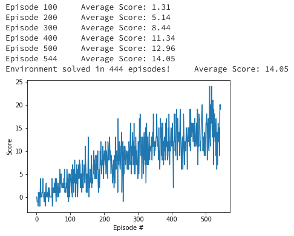

# Learning Algorithm Report
The Deep Q-Network algorithm as presented in the original paper solved the problem quite well: https://storage.googleapis.com/deepmind-media/dqn/DQNNaturePaper.pdf

### Deep Neural Network Architecture (2 hidden layers)
* Fully Connected input layer: Input 37 units, Output 64 units
* Fully Connected hidden layer 1: Input 64 units, Output 64 units
* Fully Connected hidden layer 1: Input 64 units, Output action_size

### Deep Q-Network Parameters Used
* 3000 max episodes
* 1000 max timesteps for per episode
* epsilon starting value of 1
* minimum epsilon of 0.01
* multiplicative factor for epsilon decay of 0.997

### Trained Agent Visualization
The below displays the performance of the agent during training. The agent solved the environment after 444 episodes, ultimately achieving and average score of 14.05 over 100 episodes.

